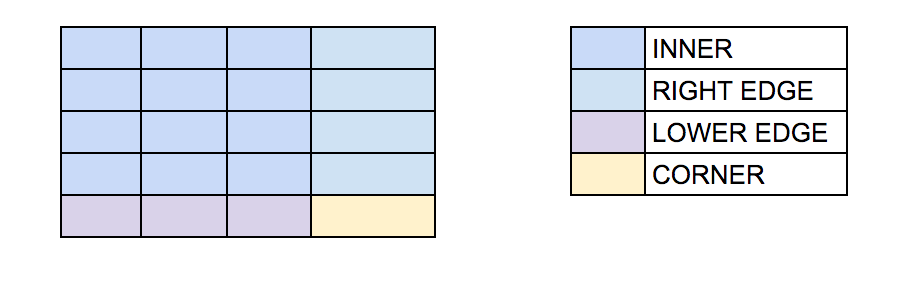
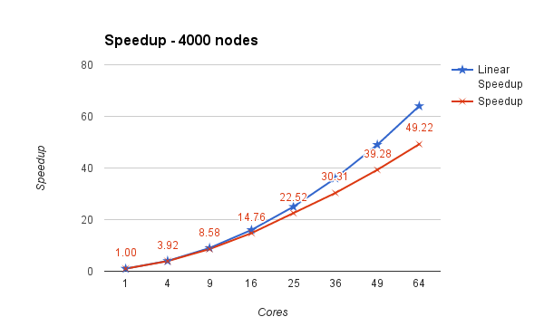
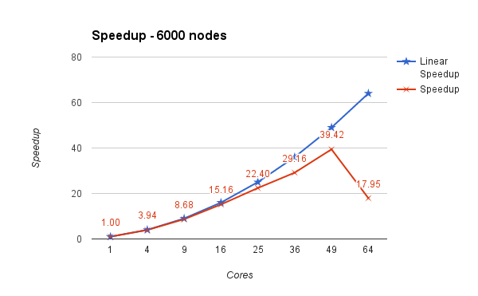
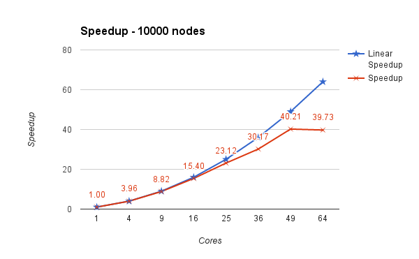

APSP MPI: All pairs shortest path algorithm using MPI
=======

**Goal:**

To parallelize the Floyd Warshall algorithm using MPI. The sequential version of the algorithm runs in O(n^3). Using 'p' cores, using our approach the running time reduces to O(n3/p + n*log p) considering communication overheads.

**Implementation:**

 Here, we have considered the input graph to be unweighted and undirected which is an adjacency matrix that gets converted to a dense matrix in the pre-processing stage.

By using a checkerboard version of the Floyd-Warshall algorithm, we visualize the placement of cores in the form of a chessboard and the dense matrix gets partitioned among the cores in a similar way. Given n nodes of graph and p cores , each core performs computations on n/√p * n/√p data (if √p divides n in equal parts).

This algorithm also handles the conditions where √p does not divide n in equal parts. In this case, our algorithm's communication pattern works differently in  different regions of the input dense matrix data. 

Parallel version of this algorithm takes it's roots from "Scalability of parallel algorithms for All pairs shortest path problem" by Vipin Kumar and Vineet Singh (1991).

**Experimental Section :**

Speedup and efficiency were calculated using the sequential and parallel running times.

Some interesting observations:
* Broadcasts happen in an exponentially lower order of time. On investigation we were bound to believe that it was because of the  extremely robust and fast IB(Infini-Band) network used in the data center.
* Broadcasts on different communicators appear to happen in parallel. We simulated this scenario using a program to broadcast 100,000 integers in row and column communicators simultaneously.

**Experimental Results:**

To substantiate the correctness and performance of the implementation, tests were run with different combinations (compute nodes x cores). The running time of the algorithm is the factor determining the efficiency of this algorithm. Speedup and Efficiency was calculated for different the combinations and the observations have been analyzed using graphs.

The below graph shows the speedup of the algorithm for different number of cores using a 4000x4000 node input dense matrix. Here, we can see that the speedup is close to linear for configurations upto 16 cores and then its gradually drops (Amdahl's law, Strong scaling - holds here as we are able achieve good speedup only upto a certain configuration and thereafter the speedup reduces).

The below graph shows the speedup of the algorithm for different number of cores using a 6000x6000 node input dense matrix.

The below graph shows the speedup of the algorithm for different number of cores using a 10000x10000 node input dense matrix. Here, we can see that the speedup is close to linear for configurations upto 25 cores, also the speedup is slightly higher than the ones seen in the 4000x4000 node matrix (Gustafson's law, Weak scaling - holds here as we are increasing the input data size and achieving better speedup).

